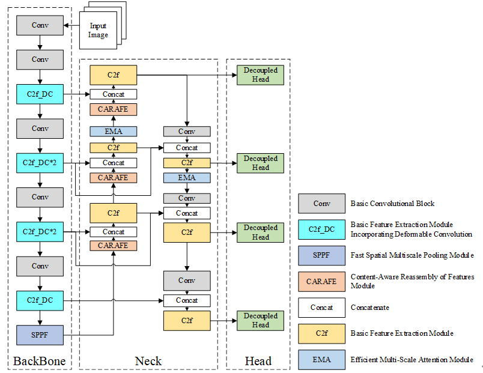

# Improved YOLOv8s Underwater Fish Target Detection by Fusing Deformable Convolutions


#### [Xin Wang](https://github.com/WangXin81)


## Usage
Data preparation:

```
path|——dataset
         |——images
           |——train
             |——0001.jpg
             |——0002.jpg
             |——....
           |——val
             |——0001.jpg
             |——0002.jpg
             |——....
         |——labels
           |——train
             |——0001.txt
             |——0002.txt
             |——....
           |——val
             |——0001.txt
             |——0002.txt
             |——....
         
```


## Figs



## Datasets:

Labeled Fishes in the Wild: 
[[Labeled Fishes in the Wild | NOAA Fisheries](https://www.fisheries.noaa.gov/west-coast/science-data/labeled-fishes-wild)]

Open Image: 
[[Open Images V7 (storage.googleapis.com)](https://storage.googleapis.com/openimages/web/index.html)]


## Environments

1. Windows 
2. cuda 12.4+
3. pytorch 1.13+
4. python 3.9+

